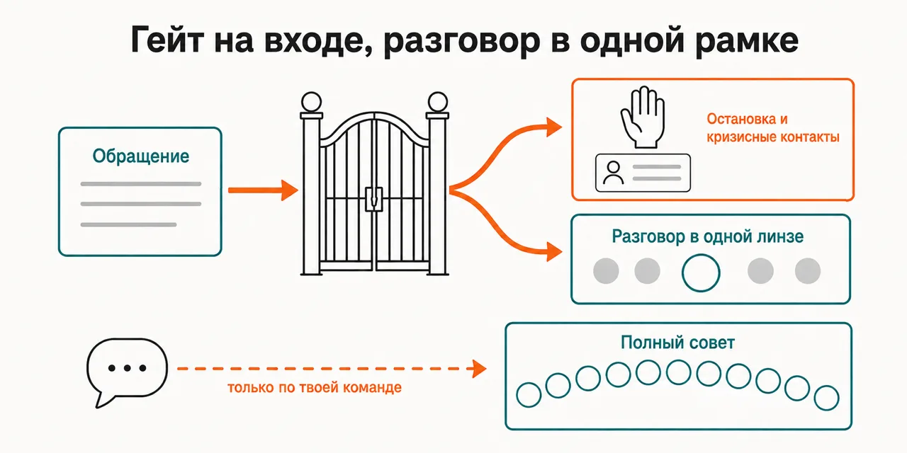
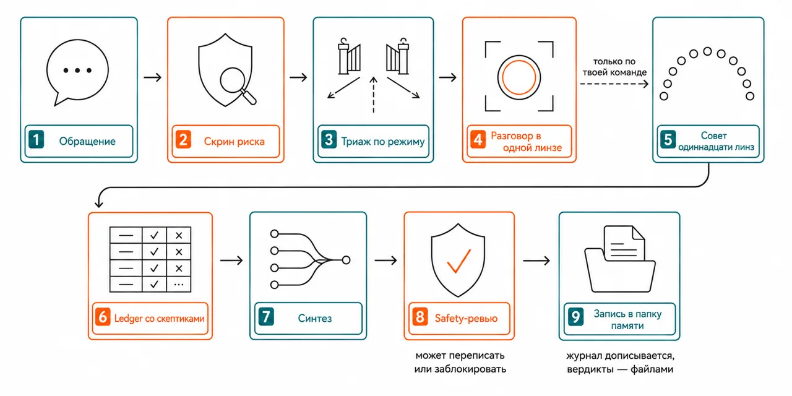

Русский · [English](README.en.md)

# Между «стало плохо» и приёмом у специалиста проходят недели, и всё это время ты остаёшься сам с собой

Не терапия и не кризисная служба: разговор идёт в одной названной вслух методологической рамке, а
на входе стоит гейт, который при признаках риска останавливает разбор и отдаёт твои кризисные
контакты.

```
claude plugin marketplace add https://github.com/beCyborg/jadlis-start.git
claude plugin install advisor-psychologist@jadlis
```

Ключей и MCP-серверов не нужно; нужна папка памяти — путь задаётся при установке, и пока в неё не
вписаны кризисные контакты твоей страны, совет не созывается.



Текстом: слева обращение обычными словами, перед ним гейт с двумя выходами — остановка с
кризисными контактами или разговор в одной линзе, — и отдельная ветка полного совета, которая
открывается только твоей командой.

Это моё рабочее место, выложенное как есть, а не продукт: чем перестал пользоваться — убрал.

## Было → стало

| Руками | Чатом с ИИ | Этим плагином |
|---|---|---|
| **Чем разбирается эпизод.** Эпизод случился в среду, приём в понедельник — к нему остаётся пересказ по памяти. | Разбирает чем угодно и в любую сторону: рамка не названа, в следующий раз она будет другой. | Ведёт разговор в одной линзе, названной вслух со строкой обоснования; смена рамки объявляется отдельно. |
| **Что происходит, когда речь заходит о риске.** Разговор продолжается: остановить его некому. | Возвращается к обычному разбору, стоит сказать «да ладно, всё нормально». | Скрин риска идёт первым и не зависит от содержания разбора: срабатывание — SAFE-STOP, заземление и контакты из твоего файла дословно; откат назад обычный режим не возвращает. |
| **Где проходит граница самопомощи.** Что делается самостоятельно, а что только на живой сессии, нигде не записано. | Отвечает на всё целиком, включая ходы, которые открывают травматический материал. | Проводит границу по операции: рескриптинг, chair work, экспозиция к утрате и работа с диссоциативным материалом помечены тиром REQUIRES-THERAPIST и уходят в раздел «вынести на живую сессию». |
| **Кто спорит с тем, что тебе насоветовали.** Спорить не с кем: версия одна. | Соглашается с той рамкой, в которой ты сам подал ситуацию. | Гоняет утверждения по одному через трёх скептиков — вред, подтверждение позиции, граница самопомощи; опровергнутое в «Что делать» не попадает, а готовый вердикт последним читает safety-ревьюер с правом переписать или заблокировать. |
| **Что остаётся после разговора.** Через месяц помнится настроение, а не то, до чего договорились. | История растворяется в чатах и в карту не собирается. | Пишет журнал сессий дописыванием, карту схем — датированными блоками, вердикты — файлами с нейтральными датированными именами в папку на твоём диске. |

## Как это работает



На входе — обращение обычными словами и гейт конфигурации: папка памяти и заполненные кризисные
контакты.
Внутри — скрин риска, потом триаж: разговор в одной рамке, короткий формат ночью и при высокой
остроте либо, по твоей команде, полный совет со скептиками.
На выходе — вердикт, прочитанный safety-ревьюером, и запись в журнале.

Текстом: обращение → скрин риска → триаж по режиму → разговор в одной линзе → по команде совет
одиннадцати линз → ledger со скептиками → синтез → safety-ревью → запись в папку памяти.

Определяет режим триаж-гейт, и режимов пять: **SAFE-STOP** при срабатывании скрина риска —
заземление, контакты дословно, маршрут к живому, без разбора; **DIALOGUE** по умолчанию — одна
линза в главной сессии, без субагентов и без досье; **LIGHT** ночью, при высокой остроте и на
закрытие разговора — ровно один шаг; **COUNCIL** только по команде «созывай совет»; **REVIEW** —
пересборка карт и скоринг прошлых предсказаний. Полный совет читают одиннадцать линз-методологий:
схема-терапия, КПТ по Беку, общие факторы и мотивационное интервью, CFT и самосострадание,
калибровочный синтез рекомендаций, поведенческая активация с экспозицией, ACT, привязанность и
IPT, горе, навыки DBT, перфекционизм и непереносимость неопределённости. Уходит к ним не сырой
контекст, а анонимизированное досье — имена заменены ролями, локации, даты и юридические факты
убраны. Дальше куратор выделяет проверяемые утверждения, скептики их голосуют, синтезатор пишет
вердикт с фронт-страницей простым языком, а safety-ревьюер читает его последним и решает:
пропустить, переписать или заблокировать. Считает обращения за скользящую неделю отдельный
частотный детектор — когда совет начинает подменять живой контакт, он называет это вслух.

## Установка и первый запуск

**а) Текст для вставки агенту.** Скопируй целиком в чат Claude Code:

```
Ты — установщик. Поставь на этот Mac плагин advisor-psychologist из маркетплейса jadlis.
Выполни ровно эти команды, дословно, ничего не сокращая:
1. claude plugin marketplace add https://github.com/beCyborg/jadlis-start.git
2. claude plugin install advisor-psychologist@jadlis
3. claude plugin list — покажи мне строку про advisor-psychologist и его версию.
Плагину нужна одна настройка — MEMORY_DIR, папка, куда он пишет журнал, домашку и вердикты.
Путь выбираю я сам; содержимое приватное, поэтому спроси меня про синхронизацию и бэкапы
этой папки, прежде чем предлагать место.
Перед каждой командой покажи её мне целиком и дождись «да». Сказал «нет» — не выполняй,
скажи, что именно пропустил, и иди дальше.
Команда вернула ошибку — остановись, покажи вывод, к следующей не переходи.
```

**б) Команды руками.**

```
claude plugin marketplace add https://github.com/beCyborg/jadlis-start.git
claude plugin install advisor-psychologist@jadlis
claude plugin list
```

Первая команда ничего не ставит — она добавляет маркетплейс. Ставит только вторая, и снимается
она одной строкой: `claude plugin uninstall advisor-psychologist@jadlis --keep-data`.

Папку памяти можно передать прямо в установку — `claude plugin install advisor-psychologist@jadlis
--config MEMORY_DIR=~/advisors-memory/Психотерапевт`, — либо задать её в диалоге, который Claude
Code показывает при включении плагина. Значение по умолчанию из манифеста не подставляется: пока
путь не задан, совет останавливается на первом же запуске и говорит об этом прямо. Поменять папку
на уже установленном плагине флагом `--config` нельзя — только переустановкой.

**Третий шаг — кризисные контакты.** Первый же запуск развернёт папку памяти, положит в неё
`_local/crisis-contacts.md` из шаблона и остановится. Впиши туда номера служб своей страны, сверив
их по официальным сайтам, и удали строку-маркер. Гейт жёсткий намеренно: разбор без работающих
контактов — ровно тот режим отказа, от которого защищает safety-протокол.

**в) Короткая команда.** Открой Claude Code в папке, где работаешь, и набери:

```
/advisor-psychologist <что происходит>
```

Не находится — сверь имя строкой `claude plugin list`. Полный разбор одиннадцатью линзами
открывается отдельной командой прямо в разговоре — словами «созывай совет»; сам он не созывается
никогда, сколько бы ходов ни прошло.

## Границы, стоимость, обновление

**Чего не делает.** Не называет себя терапией и не ведёт кризис — при подозрении на риск
останавливается и маршрутизирует к живому. Не диагностирует и не вешает DSM-ярлыки: всё, что он
даёт, — гипотезы о паттернах. Не считает баллы опросников — вообще, ни по одной шкале. Не трогает
медикаменты. Не запускает протоколы тира REQUIRES-THERAPIST ни в разговоре, ни в совете. Не даёт
больше трёх действий: список, который нельзя выполнить целиком, работает против цели. Не созывает
совет без твоей команды и не обещает результата — паттерны меняются месяцами, откаты нормальны.

**Что нужно.** Ключей и внешних CLI не нужно, MCP-серверов плагин не поднимает. Нужны две вещи:
папка памяти `MEMORY_DIR` — обычные markdown-файлы, можно положить внутрь Obsidian-vault — и
заполненный файл кризисных контактов внутри неё. Содержимое папки приватное: выбирай место с
учётом синхронизации и бэкапов. И живой терапевт рядом — формат построен как самопомощь и
психообразование при нём, а не вместо него.

**Порядок расхода токенов.** Разговор лёгкий: он идёт в главной сессии, одной линзой, без
субагентов и без досье — поэтому режимом по умолчанию сделан именно он. Тяжёлый прогон — полный
совет: десятки субагентов из твоей квоты, линзы плюс скептики по утверждениям, синтез и
safety-ревью. Ночью команда «созывай совет» исполняется коротким форматом: ночью выводы держатся
хуже, полный разбор переносится на день.

**Что честно про доказательность.** Безопасность самого формата — AI-совета по психологической
помощи — в исследованиях не установлена, а вся доказательная база методов собрана на терапии с
живым клиницистом. Правило «мишень → метод» внутри плагина — рабочие гипотезы, а не назначения;
у схема-терапии это карта паттернов, а не доказанный метод. Предохранители здесь стоят вместо
отсутствующих данных, а не поверх них.

**Проверено там, где я работаю:** мой Mac, моя подписка, моя папка памяти. Где ещё это работает —
[уточнить].

**Условия использования.** Лицензии нет: все права сохранены за автором. Читать и
пользоваться лично можно. Коммерческое использование, переиздание и включение в свои
продукты — по договорённости со мной. Дайджесты линз — производные конспекты специализированной
литературы: права на исходные книги принадлежат их авторам и издателям.

**Обновление.** У стороннего маркетплейса авто-обновление на твоей стороне выключено: пока не
запустишь первую команду, у тебя остаётся та версия, которую ты поставил.

```
claude plugin marketplace update jadlis
claude plugin update advisor-psychologist@jadlis
claude plugin list
```

Переустановка, если что-то встало криво:

```
claude plugin uninstall advisor-psychologist@jadlis --keep-data && claude plugin install advisor-psychologist@jadlis
```
